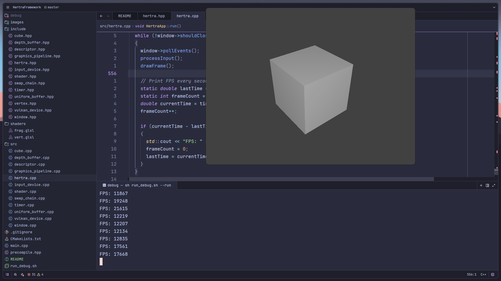

# HertraFramework

Минималистичный Vulkan-фреймворк для лабораторных работ по компьютерной графике.

## Возможности
- Рендеринг на Vulkan API
- Поддержка Wayland/Linux
- Освещение по Фонгу (Phong)
- Depth testing и back-face culling
- Вращающийся 3D куб

## Зависимости
- Vulkan
- GLFW
- GLM

## Сборка и запуск
```
sh run_debug.sh --build
sh run_debug.sh --run
```

##

